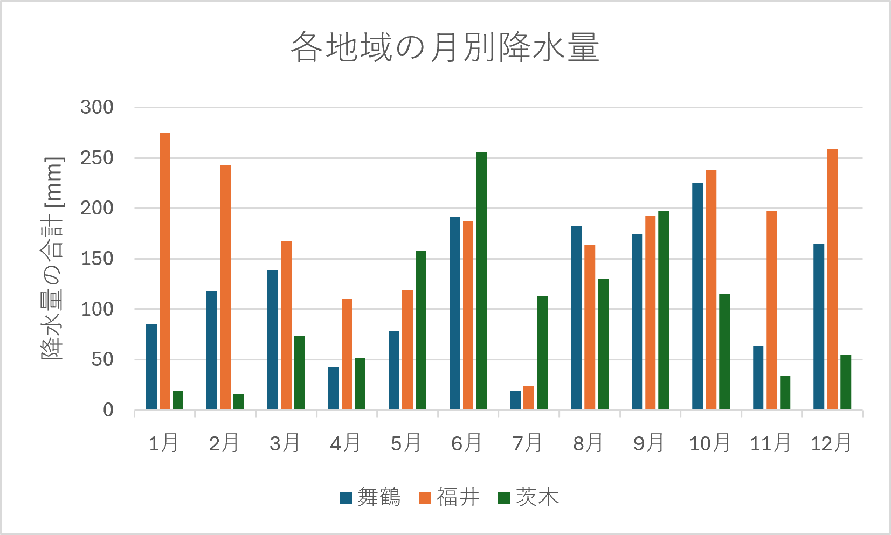

# 2026_02_B
<html>
<head>
 <title>電気情報工学実験IIIA　グループ製作 </title>
</head>
<body>
  <h1>三都市の比較</h1>
  
京都府舞鶴市、大阪府茨木市、福井県福井市の三都市を比較し、それぞれの地域の違いを考察する。

  <h2>降水量の比較</h2>
  
京都府舞鶴市、大阪府茨木市、福井県福井市の三都市の2025年の月別の降水量をまとめる。
     気象庁のオープンデータから読み取った情報を表とグラフにし、下記に示す。

  
    

　<li><a href="https://www.data.jma.go.jp/risk/obsdl/index.php" target="_blank">
　　　　　気象庁｜過去の気象データ(2026/06/15参照)</a></li>

  <h2>農作物の比較</h2>
  
京都府舞鶴市、大阪府茨木市、福井県福井市の三都市の2025年の月別
  <h2>考察</h2>

</body>
</html>
